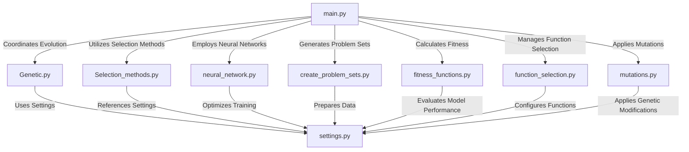

# CoEvolution-GA-Of-NeuralNetworks

## Project Overview

This project explores the co-evolution of neural networks using a genetic algorithm. The key objective is to train neural networks to classify data effectively while evolving their structure, activation functions, and optimization parameters over generations.

## Objectives

- **Neural Network Evolution**: Implement a genetic algorithm to evolve different neural network architectures and hyperparameters.
- **Dataset Classification**: Use the `glass.data` dataset to test the effectiveness of evolved neural networks in classification tasks.
- **Optimization through Evolution**: Improve the network’s learning ability by evolving activation functions, optimizers, and regularization parameters.
- **Performance Evaluation**: Assess network performance using a **confusion matrix** and **F1-score** to measure classification accuracy.
- **Mutation & Crossover in Neural Networks**: Apply genetic operators (mutation, crossover) to evolve weights and hyperparameters efficiently.
- **Scalability & Efficiency**: Explore methods like parallelization and weight caching to optimize training time.

## Repository Structure

```
CoEvolution-GA/
│-- main.py                 # Main script coordinating the evolutionary process
│-- Genetic.py              # Genetic algorithm implementation
│-- Selection_methods.py    # Various selection strategies (e.g., tournament, roulette)
│-- algorithms.py           # Contains different neural network training methods
│-- create_problem_sets.py  # Loads and processes dataset (glass.data)
│-- fitness_functions.py    # Evaluates networks using confusion matrix & F1-score
│-- function_selection.py   # Manages function selection during evolution
│-- mutations.py            # Implements mutation strategies for evolving networks
│-- neural_network.py       # Defines and trains neural networks (MLPClassifier)
│-- settings.py             # Configuration parameters
│-- setup.py                # Environment setup script
│-- inputs/                 # Contains dataset files
│-- outputs/                # Stores trained network results
│   ├── distribution/       # Stores weight distributions & analysis
```

## Dependency Map



## How the Algorithm Works

The algorithm follows a **co-evolutionary genetic process** to improve neural network performance:

1. **Data Preprocessing**
   - The dataset (`glass.data`) is loaded and split into **training** and **test** sets.
   - The data is normalized before feeding it into the neural networks.

2. **Initial Population Generation**
   - A set of neural networks is **randomly initialized**, each with different:
     - **Number of hidden layers**
     - **Neurons per layer**
     - **Activation functions** (ReLU, Sigmoid, Tanh, etc.)
     - **Optimization methods** (SGD, Adam, etc.)
     - **L2 regularization values**
   
3. **Fitness Evaluation**
   - Each neural network is trained using **MLPClassifier**.
   - Performance is evaluated using the **confusion matrix** and **F1-score**.
   - The best networks are selected for reproduction.

4. **Selection & Reproduction**
   - **Tournament selection** is used to choose the best networks.
   - **Crossover** is applied to create offspring by combining parent weights.
   - **Mutation** modifies weights and hyperparameters randomly to explore new solutions.

5. **Replacement & Iteration**
   - The weakest networks are replaced with new offspring.
   - The process repeats for a specified number of generations or until performance stabilizes.

6. **Final Model Selection**
   - The best-performing neural network is selected as the final model.
   - The results are stored in the `outputs/` directory for further analysis.

## How to Run the Project

### Installation

1. **Clone the Repository**:
   ```bash
   git clone https://github.com/AbednAboH/CoEvolution-GA.git
   cd CoEvolution-GA
   ```
2. **Install Dependencies**:
   ```bash
   pip install -r requirements.txt
   ```

### Running the Evolutionary Process

Execute the script:
```bash
python main.py
```

## Example Outputs

The `outputs/` directory stores logs and trained network performance. Example:

```
Final Best Neural Network:
- Hidden Layers: (64, 32)
- Activation Function: ReLU
- Optimizer: Adam
- F1 Score: 0.89
```

## Conclusion

This project successfully demonstrates the **co-evolution of neural networks** using genetic algorithms. By evolving different activation functions, layer structures, and optimizers, the model achieves optimized classification performance. Future work could explore:

✅ **Parallelization** to speed up training  
✅ **Caching fitness evaluations** to reduce redundant computations  
✅ **Smart initialization** of network weights for faster convergence  

---

